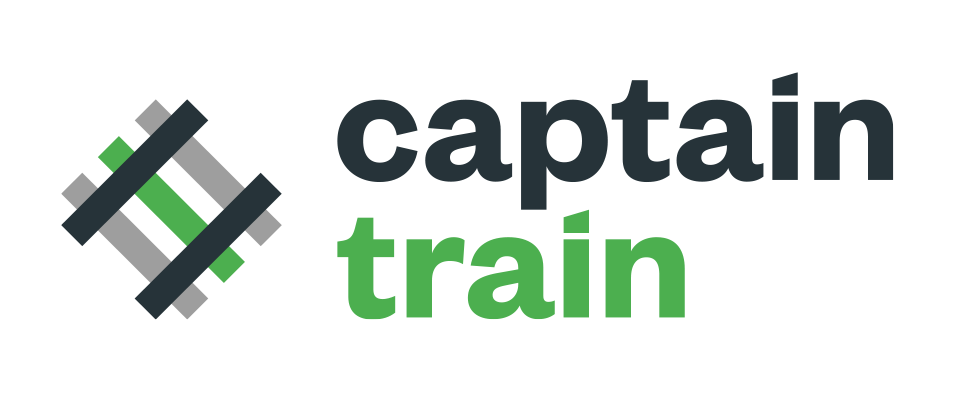

footer: Adrien Humilière // ahumiliere@captaintrain.com // L3 DANT 2015/2016    
slidenumbers: true

---

#[fit] UE _LI385_
#[fit] **Nouvelles technologies du web**

---

# Olivier Pitton / Backend

- Cloud, DevOps

# Adrien Humilière / Frontend

- Développement iOS, Swift

---

# *\#* Adrien Humilière

Ingénieur iOS @ **Captain Train**
**DANT** promotion 2011/2012
[ahumiliere@captaintrain.com](mailto:ahumiliere@captaintrain.com)

---

# *\#* Captain Train

- Plateforme d'achat de billets de train sur le web et sur mobiles.
- **19** pays - **1,3 M** utilisateurs - **5000** billets/jour
- App de l'année 2015 / App Store & Play Store

---

#[fit] Captain Train _recrute !_
### (pour info)

---

# *\#* Introduction au développement iOS

**Objectif :** Vous donner les outils pour être autonome.

- Outils de dev
- Swift
- Interfaces graphiques

---

# *\#* Prérequis ?

- Connaissance des principes de la Programmation Orientée Objet (Java)

----

#[fit] **9 semaines** × **2h45** **1h cours** + **1h45 TP**
# ~
## Le mercredi de 9h30 à 12h15 14-15, salle 409

---

#[fit] 50% **backend** + 50% **frontend** (iOS)
# ~
## **TP** notés
## **Projet** final

^ TP notés : Tous notés, moyenne sur les 4 ou 5 meilleures TPs.
