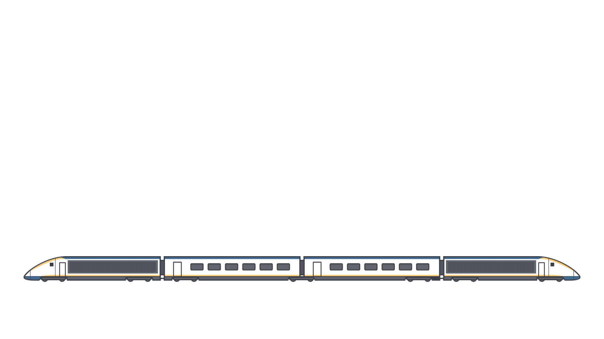

footer: Adrien Humilière // ahumiliere@captaintrain.com // L3 DANT 2015/2016    
slidenumbers: true

# Introduction au  **développement iOS**  avec Swift
### Cours 1 // *Intro, dev stack*

---

# **\#** Aujourd'hui

- Introduction
- Découverte d'Xcode et de l'environnement de dev iOS

---

#[fit] **9 semaines** × **2h45** **1h cours** + **1h45 TP**
# ~
## Le mercredi de 9h30 à 12h15 14-15, salle 504

--- 

#[fit] 50% **backend** + 50% **frontend** (iOS)
# ~
## **TP** notés 
## **Projet** final 

^ TP notés : Tous notés, moyenne sur les 4 ou 5 meilleures TPs.

---

# **\#** Salle Mac

- Ne jamais éteindre les macs
- Fermer la session en partant
- Ne pas laisser de fichiers (sessions partagées)

Salle accessible en libre service,
tous les jours de Xh à XXh *(si pas de cours)*

---

# **\#** Matériel à disposition

- 3 **iPod touch 5**
- 3 **iPad mini 1**
- 3 **iPad mini 2** (écran retina)

Disponibles en TP et empruntables au secrétariat

---

# **\#** Salle Mac

Login : `m2sar`
Password : `sarm2`