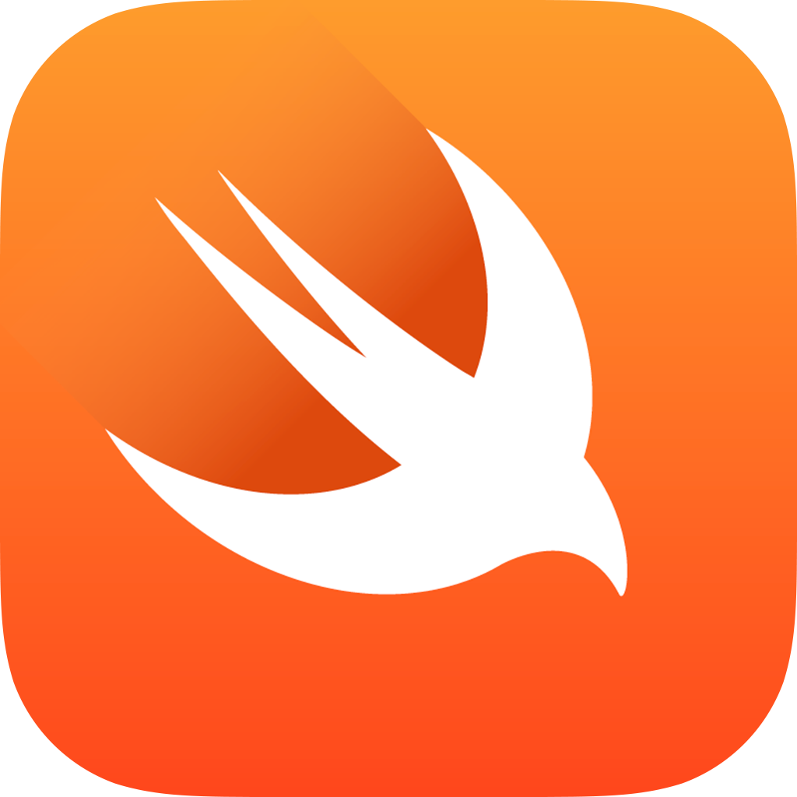

footer: Adrien Humilière // ahumiliere@captaintrain.com // L3 DANT 2015/2016    
slidenumbers: true

# Introduction au  **développement iOS**  avec *Swift*
### Cours 1 // *Intro, dev stack*

---

^ Eurostar

---

# *\#* Aujourd'hui

- Environnement de développement sur iOS
- Xcode, l'IDE

---

# *\#* L'environnement de développement iOS

---
 

^ Traditionellement, les apps iOS sont codée avec Objective-C. C'est un langage créé par Brad Cox et Tom Love.
^ C'est un langage qui existe comme une surcouche du language C.
^ Utilisé par NeXT, la société créée par Steve Jobs dans le période où il est écarté d'Apple (80's 90's)

---

# *\#* Objective-C

- Créé par **Brad Cox** et **Tom Love** (**80's**)
- **Surcouche** au langage C
- Utilisé et propagé par **NeXT** puis **Apple**

^ Traditionellement, les apps iOS sont codée avec Objective-C. C'est un langage créé par Brad Cox et Tom Love.
^ C'est un langage qui existe comme une surcouche du language C.
^ Utilisé par NeXT, la société créée par Steve Jobs dans le période où il est écarté d'Apple (80's 90's)

---
 

^ Jusqu'à il y a 2 ans

---

^ En juin 2014, Apple a annoncé un nouveau langage de programmation : Swift
^ Créé par Chris Lattner et toute une équipe qui s'est mise en palce autour de lui @ Apple.
^ Swift inclus des concepts issues d'un grand nombre de langages de programmation modernes.

---

# \# Swift

- Présenté en **juin 2014** par Apple
- Créer par **Chris Lattner**
- **Open-source**
- Inspiré d'un grand nombre de langages de programmation moderne

---

^ Pourquoi ne pas garder Objective-C et l'améliorer ?

---

# \# Swift

- Débarassé de l'héritage du C
- Moderne
- Robuste
- Concis
- Rapide

---

# \# Swift open-source

- Swift.org

---

# \# Le Compilateur : LLDB

---

# \# Frameworks

- Librairies de code
- Séparés de la librairie standard du language (peuvent provenir d'autres sources/développeurs)
- Font l'essentiel du gros œuvre 
- Permettent du dev de plus haut niveau.

---

# \# Frameworks

**Exemple :** *Lire de l'audio*

- Pas besoin d'écrire tout le code bas niveau pour s'interfacer avec les hauts-parleurs ou le casque.
- Utiliser une classe d'audio player d'un des frameworks fournis.

^ AVAudioPlayer, AVPlayer, Frameworks bas niveau quand même pour les configurations plus complexes

^ Les frameworks sont la pour ne pas avoir a reinventer la roue a chaque fois, et pour du coup pouvoir se concentrer sur les points clés d'une app, ce qu'elle fait, son ergonomie, etc.

---

---

---

# \# Les outils de dev

^ Un certain nombre d'outils qui simplifient le travail de développement et de débug.

---

# \# Xcode

- Integrated Develoment Environment (**IDE**)
- **Regroupe le code** de l'application
- Permet de **compiler** en un clic

- Inclut **Interface Builder**
	- Création simplifier d'interfaces utilisateur
	- Connection simplifiée des interfaces avec le code

---

^ Xcode
^ 5 principaux composants qu'il faut connaitre.

^ La **Toolbar** (en haut) contient les controles pour compiler et lancer l'application (Run/Stop buttons) + des indications sur les opérations en cours + un controle sur les sections affichées à l'écran

On the left is the Navigator Area, which we use to manage our project assets.
In the middle is the Editor Area, which we use to edit code and user interfaces.
- When editing a user interface or Storyboard file, the editor area switches to what we call "Interface Builder."
On the right is the Utility Area, which we will primarily use to inspect interface attributes.
- The utility area consists of Inspectors at the top, and the object library at the bottom.
At the very bottom of the Xcode interface is the Debug Area, which we use to inspect the app log or interact with the debug console.

---

# \# Instruments

- Monitoring sur ce qui se passe dans l'application pendant son exécution

---

# \# iOS Simulator

- Permet de lancer l'application iOS en cours de développement sur le Mac comme si elle s'executait sur un device iOS

---

# \# Patterns

MVC

---

# \# Clean code

- Expressive
- Readable
- Maintainable over time

---

# *The* end

---

# **\#** Salle Mac

- Ne jamais éteindre les macs
- Fermer la session en partant
- Ne pas laisser de fichiers (sessions partagées)

Salle accessible en libre service,
tous les jours de Xh à XXh *(si pas de cours)*

---

# **\#** Matériel à disposition

- 3 **iPod touch 5**
- 3 **iPad mini 1**
- 3 **iPad mini 2** (écran retina)

Disponibles en TP et empruntables au secrétariat

---

# **\#** Salle Mac

- Login : `m2sar`
- Password : `sarm2`