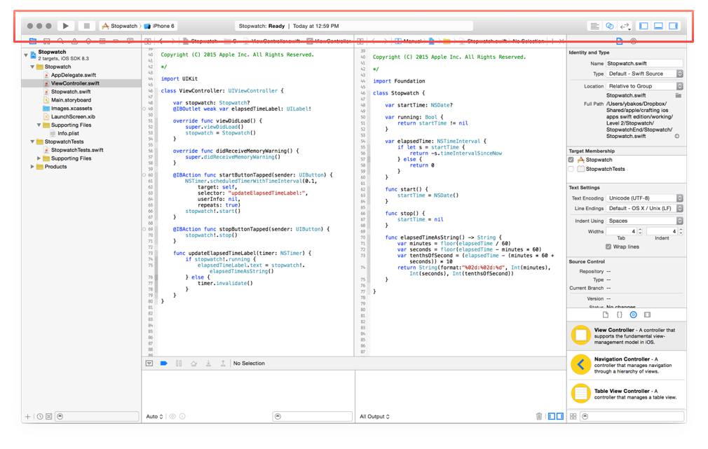

footer: Adrien Humilière // ahumiliere@captaintrain.com // L3 DANT 2015/2016    
slidenumbers: true


---

# Introduction au <br/>**développement iOS** <br/>avec *Swift*
### Cours 1 ~ *Dev stack, UI*

---


^ Eurostar

---

# *\#* Aujourd'hui

- **Environnement** de développement sur iOS
  - *__Swift, Xcode & Tools__*
- **User Interface**

---


# *\#*<br>L'environnement de développement iOS

---


^ Traditionellement, les apps iOS sont codée avec Objective-C. C'est un langage créé par Brad Cox et Tom Love.

^ C'est un langage qui existe comme une surcouche du language C.

^ Utilisé par NeXT, la société créée par Steve Jobs dans le période où il est écarté d'Apple (80's 90's)

---

# *\#* Objective-C

- Créé par **Brad Cox** et **Tom Love** (**80's**)
- **Surcouche** au langage C
- Utilisé et propagé par **NeXT** puis **Apple**

^ Traditionellement, les apps iOS sont codée avec Objective-C. C'est un langage créé par Brad Cox et Tom Love.

^ C'est un langage qui existe comme une surcouche du language C.

^ Utilisé par NeXT, la société créée par Steve Jobs dans le période où il est écarté d'Apple (80's 90's)

---


^ Jusqu'à il y a 2 ans

---


^ En juin 2014, Apple a annoncé un nouveau langage de programmation : Swift

^ Créé par Chris Lattner et toute une équipe qui s'est mise en place autour de lui @ Apple.

^ Swift inclus des concepts issues d'un grand nombre de langages de programmation modernes.

---

# \# Swift

- Présenté en **juin 2014** par Apple
- Créer par **Chris Lattner**
- **Open-source**
- Inspiré d'un grand nombre de langages de programmation moderne

^ En juin 2014, Apple a annoncé un nouveau langage de programmation : Swift

^ Créé par Chris Lattner et toute une équipe qui s'est mise en place autour de lui @ Apple.

^ Swift inclus des concepts issues d'un grand nombre de langages de programmation modernes.

---


^ Pourquoi ne pas garder Objective-C et l'améliorer ?

---

# \# Swift

- Débarassé de l'**héritage du C**
- **Moderne**
- **Robuste**
- **Concis**
- **Rapide**

---

# \# Swift

> The Swift Programming Language greatly benefited from the experiences hard-won by many other languages in the field, drawing ideas from Objective-C, Rust, Haskell, Ruby, Python, C#, CLU, and far too many others to list.
-- _**Chris Lattner**_

---

# \# Swift open-source

- Plateforme **_[Swift.org](http://www.swift.org)_**
- 100% du développement et des choix d'orientation sont **publics**
- Tout le monde peut participer

^ Depuis décembre 2015, pas immediatement, mais avec tout l'historique

---

# \# Le Compilateur : LLDB


^ standard : le compiler transforme le code readable en code machine

^ LLDB, lui aussi open source. Utilisé pour ObjC aussi depuis 2004 (auparavant GCC). Tres puissant, notamment pour le debug.

---

# \# Frameworks

- **Librairies** de code
- Séparés de la librairie standard du langage (peuvent provenir d'autres sources/développeurs)
- Font l'essentiel du **gros œuvre**
- Permettent d'écrire du code de plus haut niveau

---

# \# Frameworks

**Exemple :** *Lire de l'audio*

- **Pas besoin d'écrire tout le code bas niveau** pour s'interfacer avec les hauts-parleurs ou le casque.
- Utiliser une classe d'Audio Player d'un des frameworks fournis.

^ AVAudioPlayer, AVPlayer, Frameworks bas niveau quand même pour les configurations plus complexes

^ Les frameworks sont la pour ne pas avoir a reinventer la roue a chaque fois, et pour du coup pouvoir se concentrer sur les points clés d'une app, ce qu'elle fait, son ergonomie, etc.

---


^ 71 frameworks différents

---


^ Essentiellement une dizaine

---

# \# Les outils de dev


^ Un certain nombre d'outils qui simplifient le travail de développement et de débug.

^ Ici : Xcode, Instruments, iOS Simulator

---

# \# Xcode

- Integrated Develoment Environment (**IDE**)
- **Regroupe le code** de l'application
- Permet de **compiler** en un clic

- Inclut **Interface Builder**
	- Création simplifier d'interfaces utilisateur
	- Connection simplifiée des interfaces avec le code

---


^ Xcode
^ 5 principaux composants qu'il faut connaitre.

^ Au milieu, c'est **l'éditeur**. Il permet de modifier le code et les interfaces graphiques.

---



^ La **Toolbar** (en haut) contient les controles pour compiler et lancer l'application (Run/Stop buttons) + des indications sur les opérations en cours + un controle sur les sections affichées à l'écran

---


^ Sur la gauche, c'est le **navigateur**, qui permet de gérer toutes les données du projet, de rechercher, etc.

---


^ La zone **Utilitaire**. Divisée en deux : l'*inspecteur* en haut, la *librairie* en bas.

---


^ En bas, c'estla zone Debug. On l'utilise pour inspecter les logs et interragir avec la console de débug.

---

# \# Instruments

- Monitoring sur ce qui se passe dans l'application pendant son exécution


---

# \# iOS Simulator

- Permet de lancer l'application iOS en cours de développement sur le Mac comme si elle s'executait sur un device iOS


---


# *\#*<br>User Interfaces

---


^ Difficulté : les apps iOS se lancent sur une variété de devices (iPhone de differentes tailles, iPad, etc.)

^ Enjeu : créer une version de l'UI qui fonctione pour chaque device, taille d'écran, résolution, orientation, etc. S'adapte aux circonstances.

---

# \# Taille et position


^ Par exemple :
^ Si on veut placer un composant au milieu de l'écran.
^ Admettons qu'on dise "245 px du haut, 197 px de la droite"
^ Qu'est ce qui se passe si je suis sur une autre taille d'écran ? Ou à l'horizontale ?

---

# \# Taille et position


^ reflechir trop specifiquement avec des pixels pose des problemes de positionnement des elements.
^ possibilité : calculer les tailles et les positions ?
^ on a mieux : penser relativité et de façon plus abstraite.

---

- Multiplicité des tailles d'écran
- Différentes orientations
- Mode fenêtré sur iPad (largeur variable)
- Impossible d'estimer les tailles en points

-

# → Comment faire ?

---

# \# Abstraction **_(Size classes)_**


^ Remarquez que dans IB on a un canvas carré, pourtant aucun device n'est carré
^ Ce canvas carré est une taille d'écran abstraite. L'essentiel du design UI se passe ici, et Auto-Layout va s'adapter aux differentes Size Classes

---

# \# Abstraction **_(Size classes)_**


^ ... par exemple celle de l'iphone en portrait : la size class "Compact Width | Regular Height"

^ Il y a differentes size classes que vous serez amener à explorer. Gardez en tete que vous pouvez toujours utiliser l'assistant d'IB pour avoir un preview des differentes size class (cf. TP)

---

# \# Relativité **_(Constraints)_**

- Les contraintes sont la solution à tout ça
- Définissent comment les éléments sont positionnés par rapport aux autres

- "TextView is **relative to the vertical and horizontal center of the screen**"

^ autolayout s'occupe du reste, et s'assure que l'UI apparait comme attendu dans les differentes size classes (ou ecrans et orientations)

---

# \# Relativité **_(Constraints)_**


---

# \# Relativité **_(Constraints)_**

```swift
let constraint = NSLayoutConstraint(item: view,
                                    attribute: .TrailingMargin,
                                    relatedBy: .Equal,
                                    toItem: subView,
                                    attribute: .TrailingMargin,
                                    multiplier: 1,
                                    constant: 0)
self.addConstraint(constraint)
```

^ C'est un mecanisme tres puissant et parfois un peu complexe. Mais avec un peu de pratique on arrive à creer des intefaces sympas qui s'adaptent a tous les ecrans sans faire trop d'efforts.

---


^ The “trick” is to recognize that just because something looks a certain way on the canvas, that does not necessarily mean that this is how it will look on a device. The constraints control how things look. You know that what you see on the canvas, and what you will see in a running app, are the same when the constraints are blue.

^ Xcode highlights differences between “what you will actually see” and “what you see on the canvas” with orange. This is an indication that we should add, or adjust a constraint.

^ Once we practice this a few times, it will become natural to us. The benefit is that we can design our interface once, and Auto Layout will adapt it to as many devices as we wish.

---

# *The* end

---

# **\#** Salle Mac

- Ne jamais éteindre les macs
- Fermer la session en partant
- Ne pas laisser de fichiers (sessions partagées)

Salle accessible en libre service,
tous les jours de Xh à XXh *(si pas de cours)*

---

# **\#** Matériel à disposition

- 3 **iPod touch 5**
- 3 **iPad mini 1**
- 3 **iPad mini 2** (écran retina)

Disponibles en TP et empruntables au secrétariat

---

# **\#** Salle Mac

- Login : `m2sar`
- Password : `sarm2`
