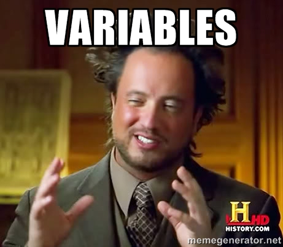
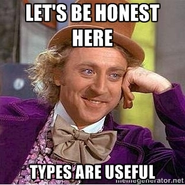
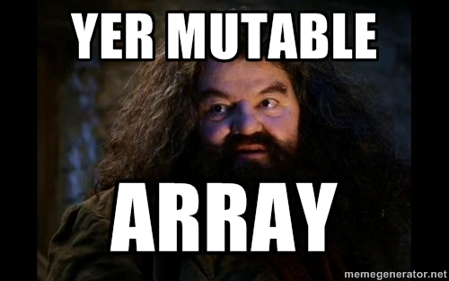
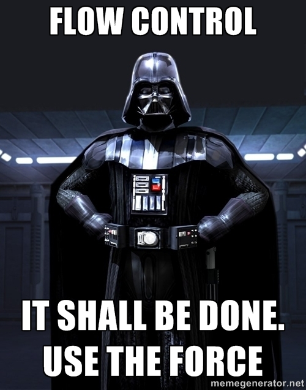
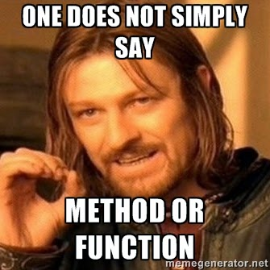

footer: Adrien Humilière // ahumiliere@captaintrain.com // L3 DANT 2015/2016    
slidenumbers: true


---

# Introduction au <br/>**développement iOS** <br/>avec *Swift*
### Cours 2 ~ *Introduction à Swift*

---


^ Renfe Grande Vitesse

---

# *\#* Aujourd'hui++

Découverte de **Swift :**

- **Syntaxe** de Swift
- **POO** avec Swift
- **Classes, objets, méthodes**
- **Types de données et collections**
- **Qualité** du code

---


## Rappel :
-
#[fit] Swift *1.2*

---


## Versions de Swift

- 1.0
- 1.1
	- __*1.2*__ 
- 2.0
- 2.1
- 2.2
- 3.0

---


# *\#*<br>Syntaxe de Swift

---

# \# Premier programme en Swift

- Hello world en Swift

```swift
print("Hello, World!")
```

^ Qu'est ce que vous remarquez de particulier ?
- Pas de point-virgule
- Pas de fonction
- Pas d'import

----

# \# Premier programme en Swift

- Hello world en Java

```java
public class Main {
    public static void main(String[] args) {
        System.out.println("Hello, World!");
    }
}
```

---

# \# Premier programme en Swift

- Hello world en Objective-C

```objc
#import <Foundation/Foundation.h>

int main (int argc, const char * argv[])
{
        NSAutoreleasePool *pool = [[NSAutoreleasePool alloc] init];
        NSLog(@"Hello, World!");
        [pool drain];
        return 0;
}
```

---


---




---

# \# Variables et constantes

- Déclaration d'une variable

```swift
var maVariable = 42
```

^ Declaration d'une variable

---

# \# Variables et constantes

- Déclaration d'une variable

```swift
var maVariable = 42
maVariable = 50
```

^ Affectation

---

# \# Variables et constantes

- Déclaration d'une constante

```swift
let maConstante = 42
```

^ Declaration d'une constante

---

# \# Variables et constantes

- Déclaration d'une constante

```swift
let maConstante = 42
maConstante = 50
// Cannot assign to 'let' value 'maConstante'
// maConstante = 50
// ~~~~~~~~~~~ ^
```

^ On ne peut pas modifier la constante

---




---

# \# Types

```swift
var monInt = 42
var monFloat = 4.1
var monString = "DANT"
```

^ Declaration de variables de différents types. Qu'est ce que vous remarquez ?

---

# \# Types

```swift
var monInt = 42
var monFloat = 4.1
var monString = "DANT"
monString = 17
```

^ Qu'est ce qui se passe si je fais ça ?

---

# \# Types **_Implicite_**

```swift
var monInt = 42
var monFloat = 4.1
var monString = "DANT"
monString = 17
// Cannot assign a value of type 'Int' to a value
// of type 'String'
// monString = 17
//            ^
```

^ Typage implicite : On ne précise pas le type. Il est déterminé à la première affectation.

---

# \# Types **_Explicite_**

```swift
var monInt: Int = 42
var monFloat: Float = 4.1
var monString: String = "DANT"
```

^ Typage explicite

---

# \# Types **_Implicite vs. Explicite_**

```swift
var entierImplicite = 42 // 42
var doubleImplicite = 42.0 // 42.0
var doubleExplicite: Double = 42 // 42.0
```

^ Typage explicite

---

# \# Types **_Conversion_**

```swift
let label = "La largeur est "
let largeur = 94
let largeurTotale = label + String(largeur)
// La largeur est 94
```

^ Les valeurs ne sont jamais converties. Il faut expressement créer une instance du type désiré pour convertir dans ce type.

---

# \# `String`

```swift
let pommes = 3
let oranges = 5
let pommesTotal = "Je possède \(pommes) pommes."
// Je possède 3 pommes.
let orangesTotal = "Je possède \(oranges) oranges."
// Je possède 5 oranges.
let fruitsTotal = "Je possède \(pommes + oranges) fruits en tout."
// Je possède 8 fruits en tout.
let pommesEtOranges = pommesTotal + " " + orangesTotal
// Je possède 3 pommes. Je possède 5 oranges.
```

^ Exception pour les strings. Conversion automatique du contenu de \() en String.
Concatenation de Strings avec "+"

---

# \# Types non spécifiques

- `AnyObject` : une instance d'une classe de n'importe quel type
- `Any` : une instance de tout type (y compris une fonction)

```swift
let array: [AnyObject] = ["DANT", 21, True] 
```

---




---

# \# Tableaux

```swift
var tableau = ["Milan", "Leila", "Alban"]
print(tableau[0])
// Milan
```

^ Initialisation et accès aux valeurs d'un tableau.
Quel type ?

---

# \# Tableaux

```swift
var tableau: [String] = ["Milan", "Leila", "Alban"]
print(tableau[0])
// Milan
```

^ Type du tableau.
Comment je peux modifier une valeur dans mon tableau ?

---

# \# Tableaux

```swift
var tableau: [String] = ["Milan", "Leila", "Alban"]
print(tableau[0])
// Milan

tableau[0] = "Khaled"
print(tableau[0])
// Khaled
```

---

# \# Tableaux

```swift
let tableau: [String] = ["Milan", "Leila", "Alban"]
tableau[0] = "Xue"
```

^ Qu'est ce qui se passe ici ?

---

# \# Tableaux

```swift
let tableau: [String] = ["Milan", "Leila", "Alban"]
tableau[0] = "Xue"
// Cannot assign to the result of this expression
// tableau2[0] = "Xue"
// ~~~~~~~~~~~ ^
```

- `let` permet de definir un tableau non-mutable

---

# \# Dictionnaires

- Même comportement que les tableaux

```swift
let dictionnaire: [String: String] = [
	"ios": "Adrien Humilière",
	"backend": "Olivier Pitton"
]
dictionnaire["reseaux"] = "Anne Fladenmuller"
```

---

# \# Tableaux et dictionnaires

- Instanciation

```swift
let tableauVide = [String]()
let dictionnaireVide = [String: Float]()
```

^ Pourquoi c'est complètement con ?

---




---

# \# Control flow

- Conditions : `if` et `switch`
- Boucles : `for-in`, `for`, `while` et `do-while`

^ Plutot obvious donc on va passer rapidement


---

# \# Control flow

- if

```swift
if moyenne > 16 {
    println("Très bien")
} else if moyenne > 10 {
    println("Bien")
} else {
    println("Pas bien")
}
```

^ Très standard, absence de parenthèses (comme pour les autres d'ailleurs)

---

# \# Control flow

```swift
switch legume {
case "celeri":
    println("Ajouter quelques raisins.")
case "concombre", "salade":
    println("Ça devrait faire un bon sandwich.")
case let x where x.hasSuffix("poivre"):
    println("On sent les épices \(x)?")
default:
    println("Tout a bon goût dans la soupe.")
}
```

^ Standard ++ : String, conditions. Très varié. Très utilisé

---

# \# Control flow

- C-style for-loop

```swift
for var i = 0; i < 10; ++i {
    // …
}
```

^ On peut faire ça. Ca marche très bien. Mais c'est déprécié dans Swift 2.2 et ça sera supprimé dans 3.0.
La solution ? 

---

# \# Control flow

```swift
for var i = 0; i < 10; ++i {
    // …
}
```

- Swift for-in equivalent

```swift
for i in 0..<10 {
    // …
}
```

^ 0..<100 créée un range

---

# \# Control flow

- while & do-while

```swift
while n < 100 {
    n += n
}
```

```swift
do {
    m += m
} while m < 100
```

---




---

# \# Fonctions et méthodes

```swift
func maFonction(argument: Int) -> String {
	return "L'argument est \(argument)"
}

print(maFonction(2016))
// L'argument est 2016
```

---


---

# \# Objets et classes

```swift
class MaClasse {
	var maPropriete = "DANT"
	
	func maMethode(annee: Int) -> [String] {
		// …
	}
}
```

^ Syntaxe relativement classique
- Nom de la classe
- Propriete
- Methode

^ Ici pas d'heritage, quest ce qui se passe si Heritage ?

---

# \# Objets et classes

```swift
class MaClasse: MaClasseMere {
	var maPropriete = "DANT"
	
	func maMethode(annee: Int) -> [String] {
		// …
	}
}
```

-> La classe `MaClasse` hérite de `MaClasseMere`

---

# \# Objets et classes **_Initialisation_**

```swift
class MaClasse {
	var maPropriete: String
	
	init() {
		maPropriete = "DANT"
	}
	
	init(name: String) {
		maPropriete = name
	}
}
```

---

# \# Objets et classes **_Initialisation_**

```swift
let objet = MaClasse()
println(objet.maPropriete)
// DANT

let objet2 = MaClasse(name: "Captain Train")
println(objet2.maPropriete)
// Captain Train
```

---


# *The* end

---

# **\#** Salle Mac

- Login : `m2sar`
- Password : `sarM2`

-

Ressources (slides, TP, etc.)

- [adhumi.fr/teaching](http://adhumi.fr/teaching)
