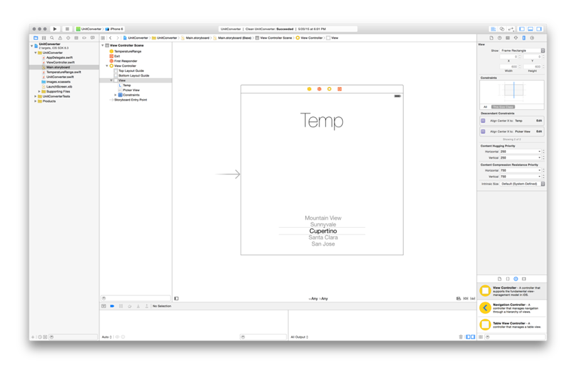

footer: Adrien Humilière // ahumiliere@captaintrain.com // L3 DANT 2015/2016    
slidenumbers: true

# Introduction au <br/>**développement iOS** <br/>avec *Swift*
### Cours 4 ~ *MVC, delegates, notifications*

---


^ ICE

---

# *\#* Aujourd'hui

**Architecture** & **API** :

- Model — View — Controller
- **Delegates** & delegation pattern
- **Notifications**

---


---


---

# \# Model


^ Qu'est ce qu'une fusée, que fait-elle ?

^ Qu'est ce qu'une planete, que fait-elle ?

---

# \# View


^ Qu'est ce que je vois ?
Pas une vraie fusée ou planete, mais la representation d'une fusee ou d'une planete

^ On ne touche aps vraiment la fusee, on touche une image de fusée. On peut interagir avec la vue.

---

# \# Controller


^ Une fusée ne sait rien de comment elle peut etre tappée ou swippée. Elle sait seulemt se deplacer et tourner.
Quand on interagis avec la vue, elle notifie le controller, qui met a jour le model.

---

# \# Controller


^ une fusee ne sait pas comment elle doit etre dessinee. Elle sait seulement comment se deplacer et tourner
Quand une vue a besoin d'informations, elle interroge le Controller.
Le controller fournis les infos pour qu'elle puisse se dessiner

---

# \# Model : __Une simple classe__

```swift
class Rocket {
   var direction: Float?
   var velocity: Double?
   var color: Color?
   let location: Location?

   func turn(direction: Direction) { … }
   func accelerate() { … }
   func decelerate() { … }
   func fireLaser() { … }
}
```

^ On y definit les proprietes, le comportement (methodes). Tout ca dans une classe.

---

# \# View : __Interface Builder__



^ Interface utilisateur de l'application. Ce qu'on voit et interragit avec.
Typiquement Interface Builder

---

# \# Controller : __UIViewController__

```swift
class ViewController: UIViewController {
    let rocket = Rocket()
    var planets = [Planet]()

    override func viewDidLoad() {
        super.viewDidLoad()
        rocket.prepareForLaunch()
        generatePlanets(planets)
    }
    
    @IBAction func swipe(sender: UISwipeG...
}
```

^ Juste du code (une classe fille de UIViewController)
Communication entre View et Model

---

# \# Model — View – Controller


^ Model: seulement le modele

^ View: seulement de l'affichage

^ ViewController: le reste

^ DELEGATE / NOTIFICATION
Moyens de communiquer entre des classes, autres que de simples appels de methodes

---


---

# \# Delegate


^ Penser a la delgation dans le monde reel. Parfois on a une tache a effectuer et on la delegue a quelqu'un d'autre

---

# \# Delegate


^ On a deja rencontré une delegation : UIApplicationDelegate (dan toutes les apps)
iOS sait faire tourner des applications, mais les specificités de l'app sont determinees par l'app delegate

---

# \# Delegate


^ Les vues se servent du patern delegate pour communiquer avec le controller

---


^ Imaginez vous deposez votre velo a reparer chez un velociste
Vous faites quoi ?
Attendre et demander toutes les 5 minutes si la reparation est faite ?
Partir et attendre que la reparation soit faite et que le velociste vous notifie de la reparation.

---

# \# NSNotificationCenter

- The app has become active
- The device has been rotated
- The device has changed location
- The app will quit
- A WiFi network has been found
- ...

^ Plein d'evenements e ce type arrivent tout le temps. NSNotificationCenter s'occupe de diffuser ces messages à tous ceux qui ecoutent.

---

# \# NSNotificationCenter

```swift
NSNotificationCenter
    .defaultCenter()
    .addObserver(self,
                 selector: "didBecomeActive",
                 name: UIApplicationDidBecomeActive,
                 object: nil)
```

^ Il y a beaucoup de notifications. L'app doit choisir auxquelles elles veut s'abonner.

---

# \# NSNotificationCenter

> “Hey NSNotificationCenter, appelle la méthode de cet objet quand cet autre objet envoie une notification avec ce nom.”

---


# *The* end

---

# \# TP du jour

- **Clock**.

- Voir **TP 4** sur [adhumi.fr/teaching](http://adhumi.fr/teaching)

---

# **\#** Salle Mac

- Login : `m2sar`
- Password : `sarM2`

-

Ressources (slides, TP, etc.)

- [adhumi.fr/teaching](http://adhumi.fr/teaching)
